# 1. DNS (Domain Name System)
DNS (_Domain Name System_) adalah sistem penamaan untuk semua device(smartphone, computer, atau
network) yang terhubung dengan internet. DNS Server berfungsi menerjemahkan nama domain menjadi alamat IP.


### 1.1 Instalasi bind dan dnsutils
Yang akan dijadikan DNS Server adalah KLAMPIS. Maka install bind pada KLAMPIS. Sebelum itu, pastikan sudah menjalankan perintah __apt-get update__.

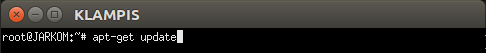

Kemudian ketikkan __apt-get install bind9__ pada KLAMPIS

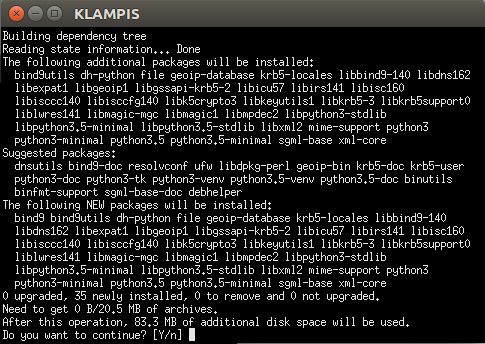

Kemudian install dnsutils pada __NGAGEL__ dan __NGINDEN__ dengan mengetikkan __apt-get install dnsutils__

### 1.2 Pembuatan Domain
Untuk membuat domain klampis.com, lakukan perintah __nano /etc/bind/named.conf.local__. Isikan seperti berikut:

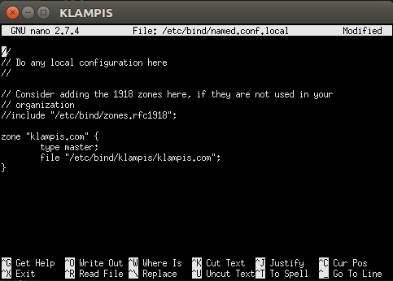

Buat folder __klampis__ di dalam __/etc/bind__ 

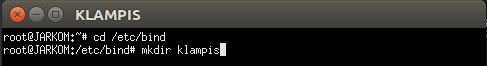

Copykan file __db.local__ ke dalam folder klampis yang baru saja dibuat dan ubah namanya menjadi __klampis.com__

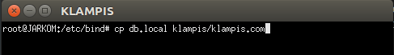

Kemudian buka file __klampis/klampis.com__ dan edit seperti berikut dengan IP KLAMPIS masing-masing kelompok:

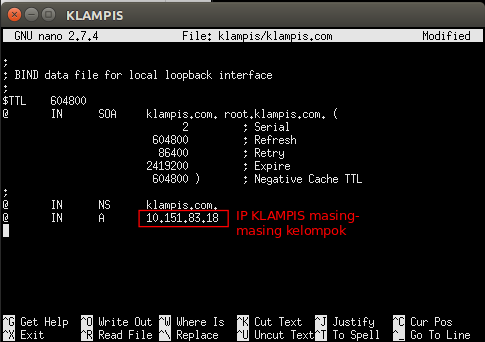

Sebelum di restart coba cek konfig yang sudah dibuat benar atau salah dengan mengetikkan __named -g__

Restart bind9 dengan perintah __service bind9 restart__

### 1.3 Setting nameserver pada client
Pada NGAGEL dan NGINDEN arahkan nameserver menuju IP KLAMPIS dengan mengedit file _resolv.conf_ dengan mengetikkan perintah __nano /etc/resolv.conf__

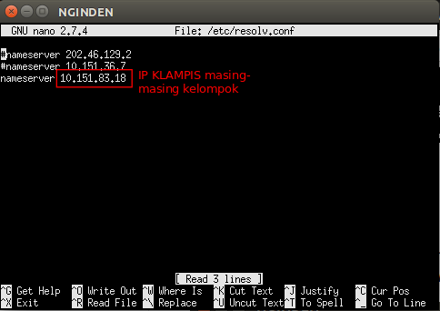

Untuk mencoba koneksi DNS, lakukan ping domain klampis.com dengan melakukan __ping klampis.com__ pada NGAGEL dan NGINDEN

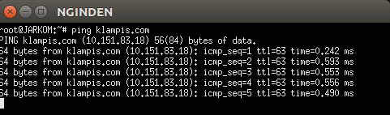

### 1.4 Reverse DNS (Record PTR)
Reverse DNS atau Record PTR digunakan untuk menerjemahkan alamat IP ke alamat domain yang sudah diterjemahkan sebelumnya. Edit file __/etc/bind/named/conf.local__ pada KLAMPIS

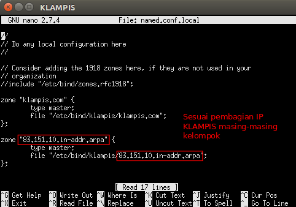

Copy file db.local ke folder klampis dan ubah namanya menjadi __83.151.10.in-addr.arpa__

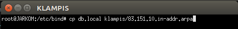

Edit file __83.151.10.in-addr.arpa__

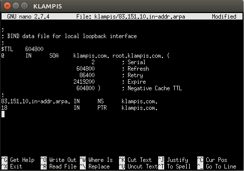

Kemudian restart bind9 dengan perintah __service bind9 restart__

Untuk mengecek lakukan perintah __nslookup__ atau __dig__

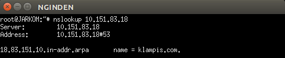

### 1.5 Record CNAME
Record CNAME adalah sebuah record yang membuat alias name dan mengarahkan domain ke alamat/domain yang lain.

Buka file klampis.com pada KLAMPIS dan tambahkan syntax berikut:

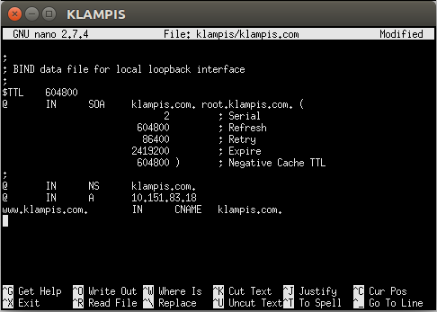

Kemudian restart bind9 dengan perintah __service bind9 restart__

Lalu cek dengan melakukan __ping www.klampis.com__ dan __ping klampis.com__ keduanya akan mengarah ke host dengan IP yang sama.

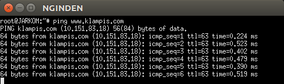


### 1.6 Membuat DNS Slave
DNS Slave adalah DNS cadangan yang akan diakses jika server DNS utama mengalami kegagalan. Lakukan __apt-get update__ kemudian install bind9 di PUCANG dengan perintah __apt-get install bind9__

Edit file __/etc/bind/named.conf.local__ pada KLAMPIS dan tambahkan syntax berikut:

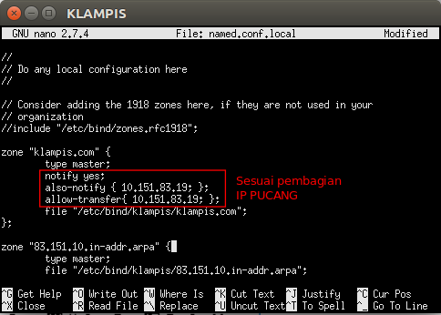

Kemudian buka file __/etc/bind/named.conf.local__ pada PUCANG dan tambahkan syntax berikut:

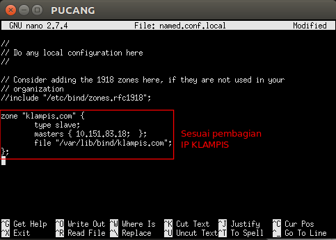

Apabila terjadi kegagalan pada DNS Server KLAMPIS, maka DNS Server akan dialihkan ke Server PUCANG. Ubah nameserver client yang tersambung dengan KLAMPIS (NGINDEN dan NGAGEL) dengan mengedit file __etc/resolv.conf__ menjadi IP PUCANG

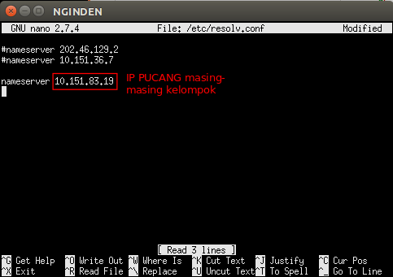

### 1.7 Membuat Subdomain
Subdomain adalah bagian dari sebuah nama domain induk. Subdomain umumnya mengacu ke suatu alamat fisik di sebuah situs contohnya: __klampis.com__ merupakan sebuah domain induk. Sedangkan __test.klampis.com__ merupakan sebuah subdomain.

Edit file __/etc/bind/klampis/klampis.com__ lalu tambahkan subdomain untuk klampis.com yang mengarah ke IP KLAMPIS.

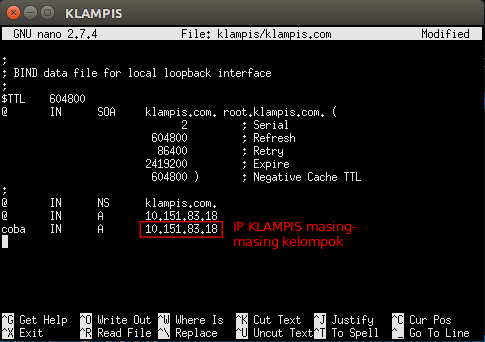

### 1.8 Delegasi Subdomain
Delegasi subdomain adalah pemberian wewenang atas sebuah subdomain kepada DNS baru.

Pada KLAMPIS, edit file __/etc/bind/klampis/klampis.com__ dan ubah menjadi seperti di bawah ini sesuai dengan pembagian IP KLAMPIS kelompok masing-masing.

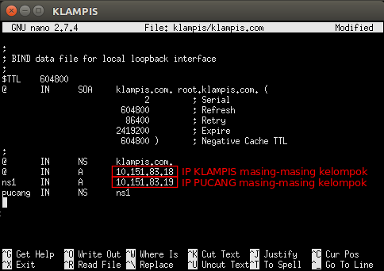

Kemudian comment __dnssec-validation auto;__ dan tambahkan baris berikut pada __/etc/bind/named.conf.options__


Kemudian edit file __/etc/bind/named.conf.local__ menjadi seperti gambar di bawah:

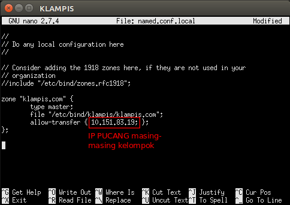

Setelah itu restart dengan menjalankan __service bind9 restart__

Pada PUCANG, comment __dnssec-validation auto;__ dan tambahkan baris berikut pada __/etc/bind/named.conf.options__

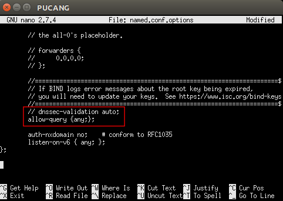

Kemudian edit file __/etc/bind/named.conf.local__ menjadi seperti gambar di bawah:

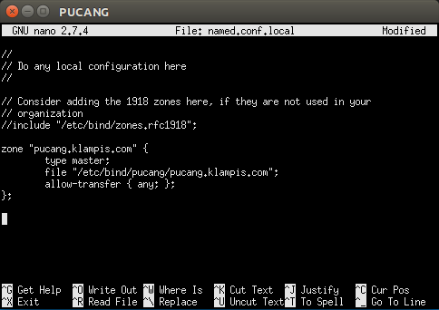

Kemudian pada __/etc/bind/pucang/pucang.klampis.com__ ubah dan tambahkan record NS dan A untuk domain __pucang.klampis.com__ dan satu lagi record A untuk subdomain www.pucang.klampis.com yang mengarah ke PUCANG (sesuaikan dengan IP masing-masing)

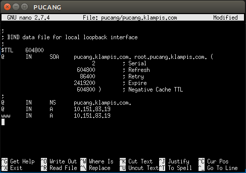

Restart dengan menjalankan __service bind9 restart__

Setelah mendelegasikan zone pucang.klampis.com menuju __PUCANG__, kita dapat mengakses subdomain (www.pucang.klampis.com) yang ada pada pucang.klampis.com dengan menggunakan nameserver __KLAMPIS__ maupun __PUCANG__ dengan cara ping www.pucang.klampis.com pada client (__NGAGEL__ dan __NGINDEN__)

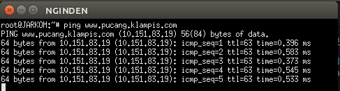
### 1.9 List DNS Record
| Tipe          | Deskripsi                     |
| ------------- |:-----------------------------|
| A             | Memetakan nama domain ke alamat IP (IPv4) dari komputer hosting domain|
| AAAA          | AAAA record hampir mirip A record, tapi mengarahkan domain ke alamat Ipv6|
| CNAME         | Alias ​​dari satu nama ke nama lain: pencarian DNS akan dilanjutkan dengan mencoba lagi pencarian dengan nama baru|
| NS            | Delegasikan zona DNS untuk menggunakan authoritative name servers yang diberikan|
| PTR           | Digunakan untuk Reverse DNS (Domain Name System) lookup|
| SOA           | Mengacu server DNS yang mengediakan otorisasi informasi tentang sebuah domain Internet|
| TXT           | Mengijinkan administrator untuk memasukan data acak ke dalam catatan DNS, catatan ini juga digunakan di spesifikasi Sender Policy Framework|

### 2.0 Keterangan
- #### SOA (Start of Authority)
| Nama          | Deskripsi                     |
| ------------- |:-----------------------------|
| Serial        | Jumlah revisi dari file zona ini. Kenaikan nomor ini setiap kali file zone diubah sehingga perubahannya akan didistribusikan ke server DNS sekunder manapun|
| Refresh       | Jumlah waktu dalam detik bahwa nameserver sekunder harus menunggu untuk memeriksa salinan baru dari zona DNS dari nameserver utama domain. Jika file zona telah berubah maka server DNS sekunder akan memperbarui salinan zona tersebut agar sesuai dengan zona server DNS utama|
| Retry         | Jumlah waktu dalam hitungan detik bahwa nameserver utama domain (atau server) harus menunggu jika upaya refresh oleh nameserver sekunder gagal sebelum mencoba refresh zona domain dengan nameserver sekunder itu lagi|
| Expire        | Jumlah waktu dalam hitungan detik bahwa nameserver sekunder (atau server) akan menahan zona sebelum tidak lagi mempunyai otoritas|
| Minimum       | Jumlah waktu dalam hitungan detik bahwa catatan sumber daya domain valid. Ini juga dikenal sebagai TTL minimum, dan dapat diganti oleh TTL catatan sumber daya individu|
| TTL           | (waktu untuk tinggal) - Jumlah detik nama domain di-cache secara lokal sebelum kadaluarsa dan kembali ke nameserver otoritatif untuk informasi terbaru|

- #### Penulisan Serial
1. Ditulis dengan format YYYYMMDDXXX
```
YYYY adalah tahun
MM adalah bulan
DD adalah tanggal
XXX adalah counter
```
Contoh :


## Latihan
1. Buatlah domain mawho.com dan www.mawho.com (CNAME mawho.com). Apa yang terjadi jika melakukan ping mawho.com dengan ping www.mawho.com? Mengapa hal itu terjadi?
2. Buatlah sebuah subdomain pada domain mawho.com dengan nama abc.mawho.com

## References
* https://computer.howstuffworks.com/dns.htm
* http://knowledgelayer.softlayer.com/faq/what-does-serial-refresh-retry-expire-minimum-and-ttl-mean
* https://en.wikipedia.org/wiki/List_of_DNS_record_types
* https://kb.indowebsite.id/knowledge-base/pengertian-catatan-dns-atau-record-dns/
