# 1. DNS (Domain Name System)
DNS (_Domain Name System_) adalah sistem penamaan untuk semua device(smartphone, computer, atau
network) yang terhubung dengan internet. DNS Server berfungsi menerjemahkan nama domain menjadi alamat IP.


### 1.1 Instalasi bind
Yang akan dijadikan DNS Server adalah KLAMPIS. Maka install bind pada KLAMPIS. Sebelum itu, pastikan sudah menjalankan perintah **apt-get update**.

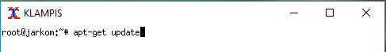

Kemudian ketikkan **apt-get install bind9** pada KLAMPIS

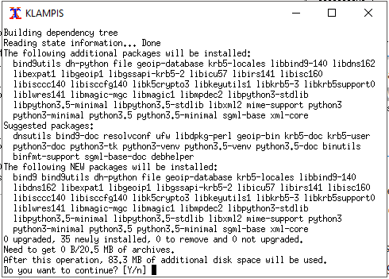

### 1.2 Pembuatan Domain
Untuk membuat domain klampis.com, lakukan perintah **nano /etc/bind/named.conf.local**. Isikan seperti berikut:

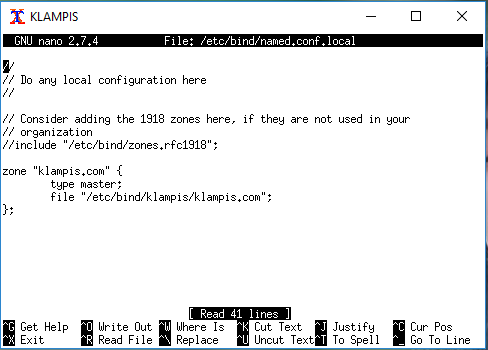

Buat folder **klampis** di dalam **/etc/bind** 

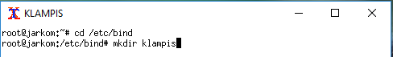

Copykan file **db.local** ke dalam folder klampis yang baru saja dibuat dan ubah namanya menjadi **klampis.com**

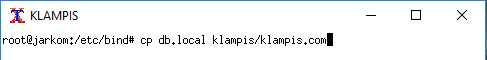

Kemudian buka file **klampis/klampis.com** dan edit seperti berikut dengan IP KLAMPIS masing-masing kelompok:

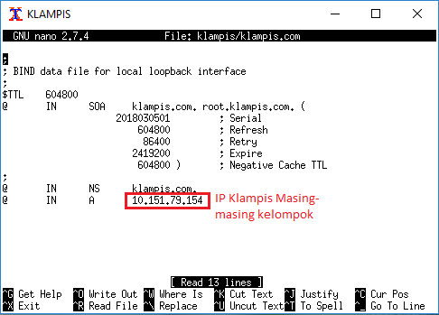

Restart bind9 dengan perintah **service bind9 restart** atau menggunakan perintah **named -g** untuk restart dan debugging.

### 1.3 Setting nameserver pada client
Pada NGAGEL dan NGINDEN arahkan nameserver menuju IP KLAMPIS dengan mengedit file _resolv.conf_ dengan mengetikkan perintah **nano /etc/resolv.conf**

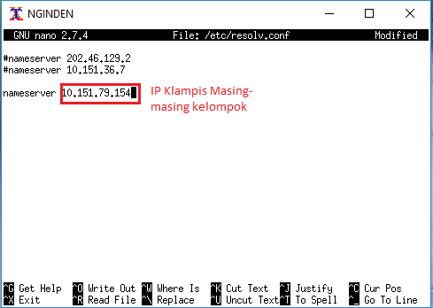

Untuk mencoba koneksi DNS, lakukan ping domain klampis.com dengan melakukan **ping klampis.com** pada NGAGEL dan NGINDEN

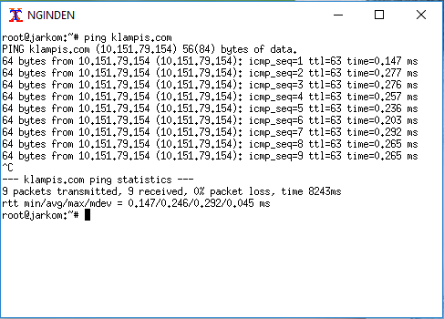

### 1.4 Reverse DNS (Record PTR)
Reverse DNS atau Record PTR digunakan untuk menerjemahkan alamat IP ke alamat domain yang sudah diterjemahkan sebelumnya. Edit file **/etc/bind/named.conf.local** pada KLAMPIS

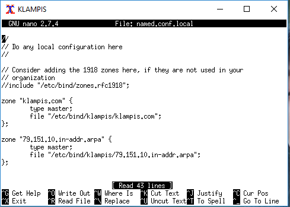

Copy file db.local ke folder klampis dan ubah namanya menjadi **79.151.10.in-addr.arpa**

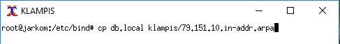

Edit file **79.151.10.in-addr.arpa**

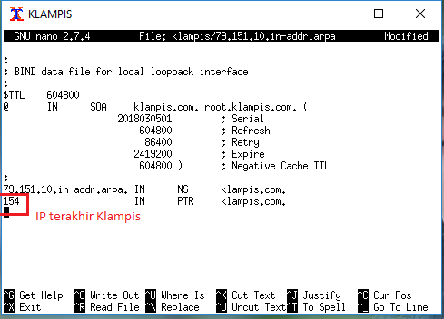

Kemudian restart bind9 dengan perintah **service bind9 restart**

Untuk mengecek lakukan perintah **nslookup** atau **dig**

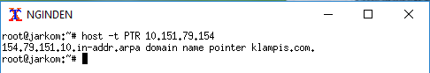

### 1.5 Record CNAME
Record CNAME adalah sebuah record yang membuat alias name dan mengarahkan domain ke alamat/domain yang lain.

Buka file klampis.com pada KLAMPIS dan tambahkan syntax berikut:

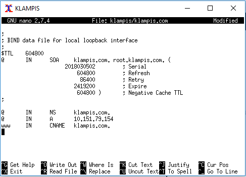

Kemudian restart bind9 dengan perintah **service bind9 restart**

Lalu cek dengan melakukan **host -t CNAME www.klampis.com** atau **ping www.klampis.com** akan mengarah ke host dengan IP KLAMPIS.

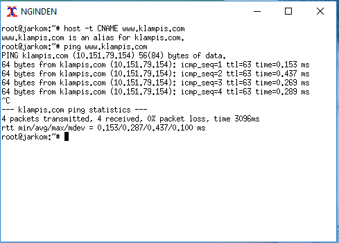


### 1.6 Membuat DNS Slave
DNS Slave adalah DNS cadangan yang akan diakses jika server DNS utama mengalami kegagalan. Lakukan **apt-get update** kemudian install bind9 di PUCANG dengan perintah **apt-get install bind9**

Edit file **/etc/bind/named.conf.local** pada KLAMPIS dan tambahkan syntax berikut:

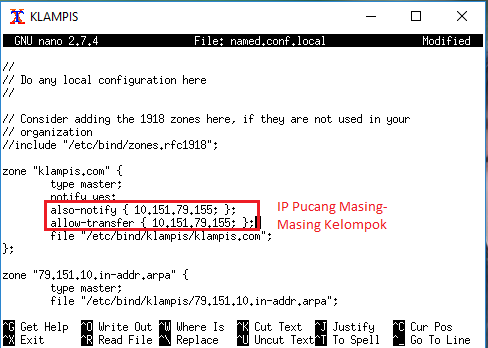

Kemudian buka file **/etc/bind/named.conf.local** pada PUCANG dan tambahkan syntax berikut:

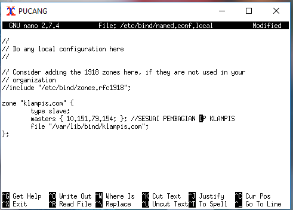

Restart **service bind9 restart**

Apabila terjadi kegagalan pada DNS Server KLAMPIS, maka DNS Server akan dialihkan ke Server PUCANG. Ubah nameserver client yang tersambung dengan KLAMPIS (NGINDEN dan NGAGEL) dengan mengedit file **etc/resolv.conf** menjadi IP PUCANG

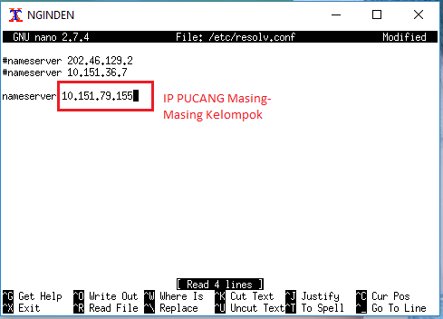

### 1.7 Membuat Subdomain
Subdomain adalah bagian dari sebuah nama domain induk. Subdomain umumnya mengacu ke suatu alamat fisik di sebuah situs contohnya: **klampis.com** merupakan sebuah domain induk. Sedangkan **test.klampis.com** merupakan sebuah subdomain.

Edit file **/etc/bind/klampis/klampis.com** lalu tambahkan subdomain untuk klampis.com yang mengarah ke IP KLAMPIS.

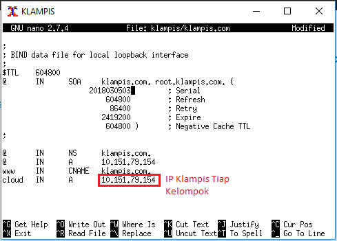

Restart **service bind9 restart**

Coba ping ke subdomain dengan perintah **ping cloud.klampis.com" atau **host -t A cloud.klampis.com**

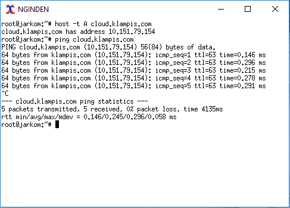


### 1.8 Delegasi Subdomain
Delegasi subdomain adalah pemberian wewenang atas sebuah subdomain kepada DNS baru.

Pada KLAMPIS, edit file **/etc/bind/klampis/klampis.com** dan ubah menjadi seperti di bawah ini sesuai dengan pembagian IP KLAMPIS kelompok masing-masing.

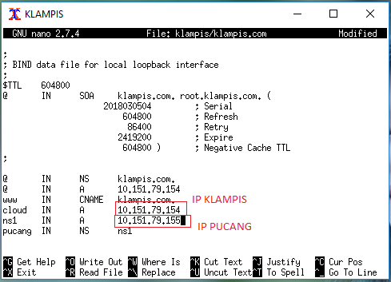

Kemudian comment **dnssec-validation auto;** dan tambahkan baris berikut pada **/etc/bind/named.conf.options**

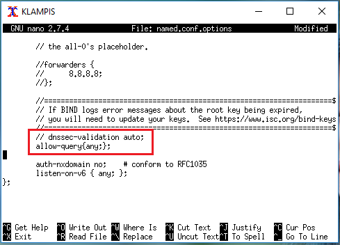

Kemudian edit file **/etc/bind/named.conf.local** menjadi seperti gambar di bawah:

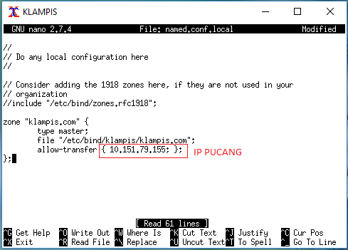

Setelah itu restart dengan menjalankan **service bind9 restart**

Pada PUCANG, comment **dnssec-validation auto;** dan tambahkan baris berikut pada **/etc/bind/named.conf.options**

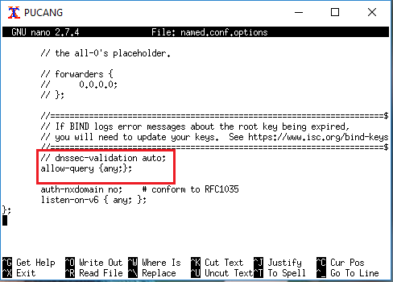

Masuk direktori /etc/bind **cd /etc/bind/** Kemudian edit file **named.conf.local** menjadi seperti gambar di bawah:

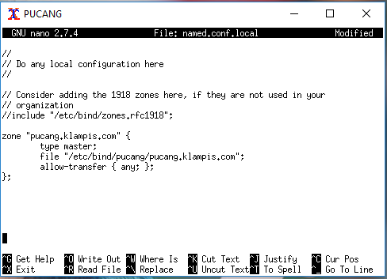

Kemudian buat direktori dengan nama pucang **mkdir pucang** dan copy db.local ke direktori pucang dan edit namanya menjadi pucang.klampis.com **cp db.local pucang/pucang.klampis.com**

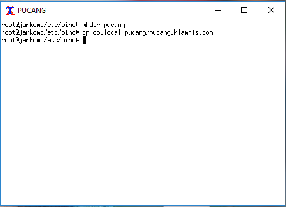

Kemudian pada **/etc/bind/pucang/pucang.klampis.com** ubah dan tambahkan record NS dan A untuk domain **pucang.klampis.com** dan satu lagi record A untuk subdomain www.pucang.klampis.com yang mengarah ke PUCANG (sesuaikan dengan IP masing-masing)

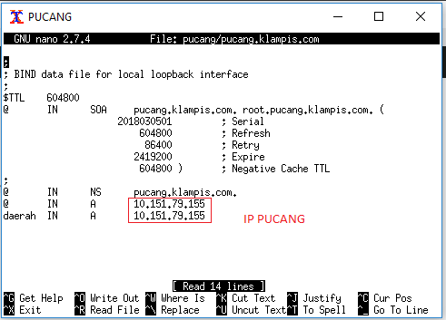

Restart dengan menjalankan **service bind9 restart**

Setelah mendelegasikan zone pucang.klampis.com menuju **PUCANG**, kita dapat mengakses subdomain (daerah.pucang.klampis.com) yang ada pada pucang.klampis.com dengan menggunakan nameserver **KLAMPIS** maupun **PUCANG** dengan cara **ping daerah.pucang.klampis.com** pada client (**NGAGEL** dan **NGINDEN**)

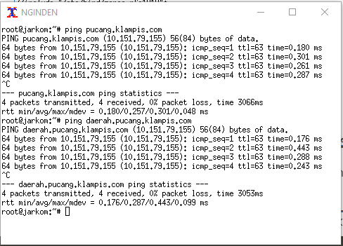

### 1.9 DNS Forwarder

DNS Forwarder digunakan untuk mengarahkan DNS Server ke IP yang ingin dituju.

Edit file di /etc/bind/named.conf.option
Uncomment pada bagian ini
```
forwarders {
    8.8.8.8;
};
```
Comment pada bagian ini
```
// dnssec-validation auto;
```
Dan tambahkan
```
allow-query{any;};
```

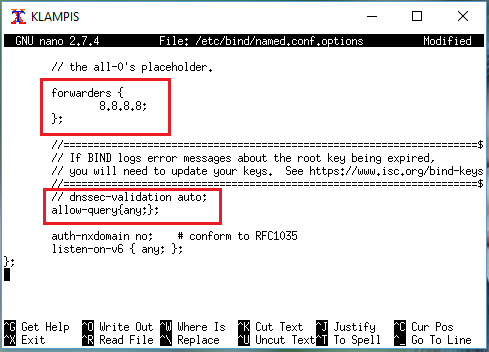

Harusnya jika nameserver pada /etc/resolv.conf diubah menjadi IP KLAMPIS maka akan diforward ke IP google yaitu 8.8.8.8 dan bisa mendapatkan koneksi.

### 2.0 List DNS Record
| Tipe          | Deskripsi                     |
| ------------- |:-----------------------------|
| A             | Memetakan nama domain ke alamat IP (IPv4) dari komputer hosting domain|
| AAAA          | AAAA record hampir mirip A record, tapi mengarahkan domain ke alamat Ipv6|
| CNAME         | Alias ​​dari satu nama ke nama lain: pencarian DNS akan dilanjutkan dengan mencoba lagi pencarian dengan nama baru|
| NS            | Delegasikan zona DNS untuk menggunakan authoritative name servers yang diberikan|
| PTR           | Digunakan untuk Reverse DNS (Domain Name System) lookup|
| SOA           | Mengacu server DNS yang mengediakan otorisasi informasi tentang sebuah domain Internet|
| TXT           | Mengijinkan administrator untuk memasukan data acak ke dalam catatan DNS, catatan ini juga digunakan di spesifikasi Sender Policy Framework|

### 2.1 Keterangan
- #### SOA (Start of Authority)
| Nama          | Deskripsi                     |
| ------------- |:-----------------------------|
| Serial        | Jumlah revisi dari file zona ini. Kenaikan nomor ini setiap kali file zone diubah sehingga perubahannya akan didistribusikan ke server DNS sekunder manapun|
| Refresh       | Jumlah waktu dalam detik bahwa nameserver sekunder harus menunggu untuk memeriksa salinan baru dari zona DNS dari nameserver utama domain. Jika file zona telah berubah maka server DNS sekunder akan memperbarui salinan zona tersebut agar sesuai dengan zona server DNS utama|
| Retry         | Jumlah waktu dalam hitungan detik bahwa nameserver utama domain (atau server) harus menunggu jika upaya refresh oleh nameserver sekunder gagal sebelum mencoba refresh zona domain dengan nameserver sekunder itu lagi|
| Expire        | Jumlah waktu dalam hitungan detik bahwa nameserver sekunder (atau server) akan menahan zona sebelum tidak lagi mempunyai otoritas|
| Minimum       | Jumlah waktu dalam hitungan detik bahwa catatan sumber daya domain valid. Ini juga dikenal sebagai TTL minimum, dan dapat diganti oleh TTL catatan sumber daya individu|
| TTL           | (waktu untuk tinggal) - Jumlah detik nama domain di-cache secara lokal sebelum kadaluarsa dan kembali ke nameserver otoritatif untuk informasi terbaru|

- #### Penulisan Serial
1. Ditulis dengan format YYYYMMDDXXX
```
YYYY adalah tahun
MM adalah bulan
DD adalah tanggal
XXX adalah counter
```
Contoh :

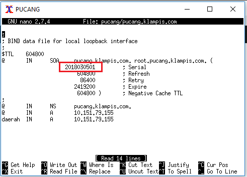

## Latihan
1. Buatlah domain mawho.com dan www.mawho.com (CNAME mawho.com). Apa yang terjadi jika melakukan ping mawho.com dengan ping www.mawho.com? Mengapa hal itu terjadi?
2. Buatlah sebuah subdomain pada domain mawho.com dengan nama abc.mawho.com

## References
* https://computer.howstuffworks.com/dns.htm
* http://knowledgelayer.softlayer.com/faq/what-does-serial-refresh-retry-expire-minimum-and-ttl-mean
* https://en.wikipedia.org/wiki/List_of_DNS_record_types
* https://kb.indowebsite.id/knowledge-base/pengertian-catatan-dns-atau-record-dns/
