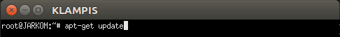
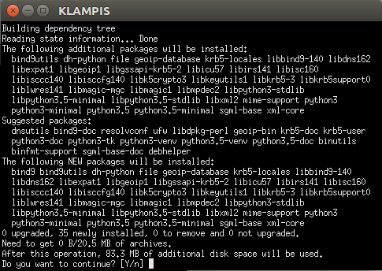
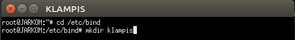
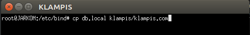
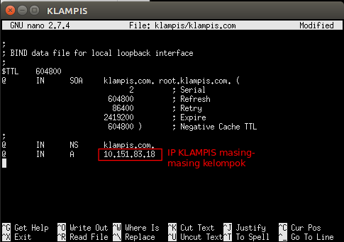
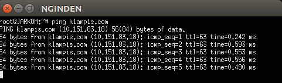
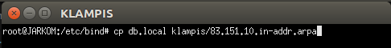
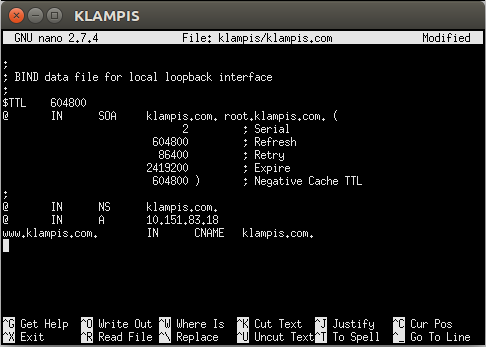
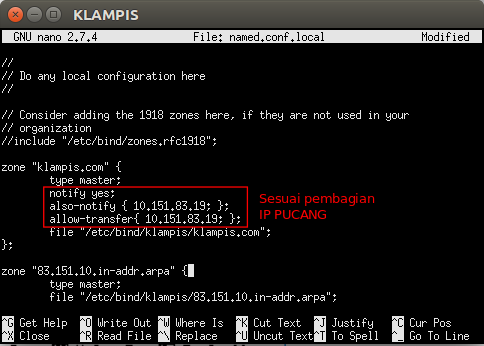
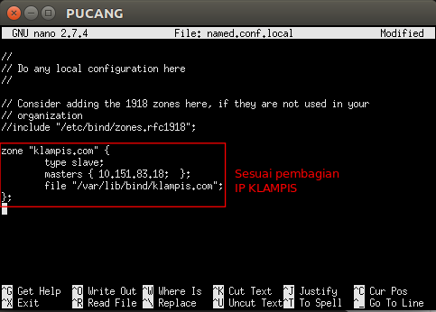

# Modul 2 Jaringan Komputer

# 1. DNS (Domain Name System)
DNS (_Domain Name System_) adalah sistem penamaan untuk semua device(smartphone, computer, atau
network) yang terhubung dengan internet. DNS Server berfungsi menerjemahkan nama domain menjadi alamat IP.

### 1.1 Instalasi bind dan dnsutils
Yang akan dijadikan DNS Server adalah KLAMPIS. Maka install bind pada KLAMPIS. Sebelum itu, pastikan sudah menjalankan perintah __apt-get update__.

Kemudian ketikkan __apt-get install bind9__ pada KLAMPIS

Kemudian install dnsutils pada __NGAGEL__ dan __NGINDEN__ dengan mengetikkan __apt-get install dnsutils__

### 1.2 Pembuatan Domain
Untuk membuat domain klampis.com, lakukan perintah __nano /etc/bind/named.conf.local__. Isikan seperti berikut:

Buat folder __klampis__ di dalam __/etc/bind__ 

Copykan file __db.local__ ke dalam folder klampis yang baru saja dibuat dan ubah namanya menjadi __klampis.com__

Kemudian buka file __klampis/klampis.com__ dan edit seperti berikut dengan IP KLAMPIS masing-masing kelompok:

Restart bind9 dengan perintah __service bind9 restart__

### 1.3 Setting nameserver pada client
Pada NGAGEL dan NGINDEN arahkan nameserver menuju IP KLAMPIS dengan mengedit file _resolv.conf_ dengan mengetikkan perintah __nano /etc/resolv.conf__

Untuk mencoba koneksi DNS, lakukan ping domain klampis.com dengan melakukan __ping klampis.com__ pada NGAGEL dan NGINDEN

### 1.4 Reverse DNS (Record PTR)
Reverse DNS atau Record PTR digunakan untuk menerjemahkan alamat IP ke alamat domain yang sudah diterjemahkan sebelumnya. Edit file __/etc/bind/named/conf.local__ pada KLAMPIS

Copy file db.local ke folder klampis dan ubah namanya menjadi __83.151.10.in-addr.arpa__

Edit file __83.151.10.in-addr.arpa__

Kemudian restart bind9 dengan perintah __service bind9 restart__

Untuk mengecek lakukan perintah __nslookup__ atau __dig__

### 1.5 Record CNAME
Record CNAME adalah sebuah record yang membuat alias name dan mengarahkan domain ke alamat/domain yang lain.

Buka file klampis.com pada KLAMPIS dan tambahkan syntax berikut:

Kemudian restart bind9 dengan perintah __service bind9 restart__

Lalu cek dengan melakukan __ping www.klampis.com__ dan __ping klampis.com__ keduanya akan mengarah ke host dengan IP yang sama.

### 1.6 Membuat DNS Slave
DNS Slave adalah DNS cadangan yang akan diakses jika server DNS utama mengalami kegagalan. Lakukan __apt-get update__ kemudian install bind9 di PUCANG dengan perintah __apt-get install bind9__

Edit file __/etc/bind/named.conf.local__ pada KLAMPIS dan tambahkan syntax berikut:

Kemudian buka file __/etc/bind/named.conf.local__ pada PUCANG dan tambahkan syntax berikut:

Apabila terjadi kegagalan pada DNS Server KLAMPIS, maka DNS Server akan dialihkan ke server PUCANG. Ubah nameserver client yang tersambung dengan KLAMPIS (NGAGEL dan NGINDEN) dengan mengedit file __/etc/resolv.conf__ menjadi IP PUCANG