# 2. Web Server
Web Server adalah perangkat yang menyediakan layanan akses kepada pengguna melalui protokol HTTP atau HTTPS melalui aplikasi web.

### 2.1 Instalasi apache2
Install Web Server Apache pada PUCANG yang sebelumnya sudah diupdate dengan mengetikkan __apt-get install apache2__. Setelah proses instalasi selesai, coba akses __IP PUCANG TIAP KELOMPOK__ pada browser maka akan muncul seperti gambar di bawah:

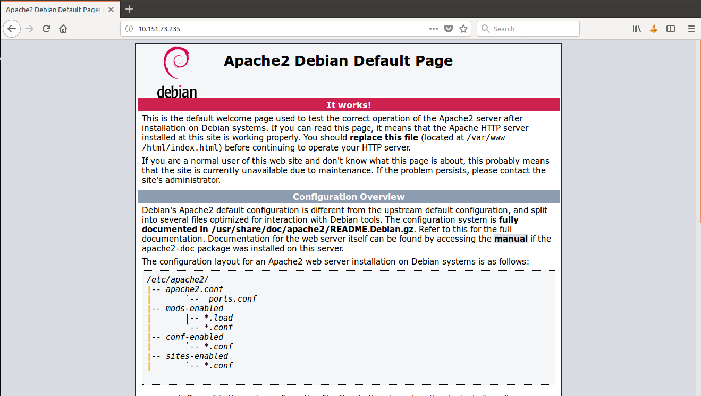

### 2.2 Instalasi PHP pada PUCANG
Supaya web server dapat menjalankan perintah PHP, maka kita perlu menginstall PHP pada PUCANG dengan mengetikkan __apt-get install php__

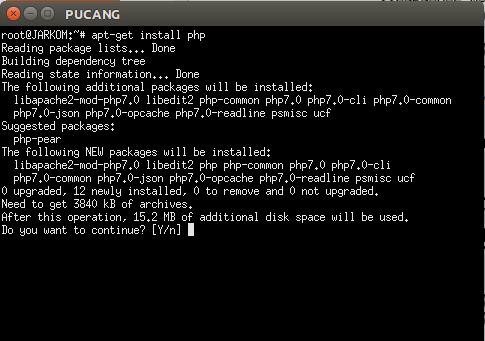

Setelah proses instalasi selesai, untuk mengetahui apakah instalasi PHP berhasil atau tidak, silahkan membuat file PHP yang diletakkan di __/var/www/html__
```
cd /var/www/html
nano ini.php
```

Kemudian isikan pada file __ini.php__:
```
<?php phpinfo(); ?>
```

Setelah selesai membuat file __ini.php__, untuk mencoba membukanya akses dengan __IP PUCANG TIAP KELOMPOK/ini.php__ maka akan muncul seperti gambar di bawah:

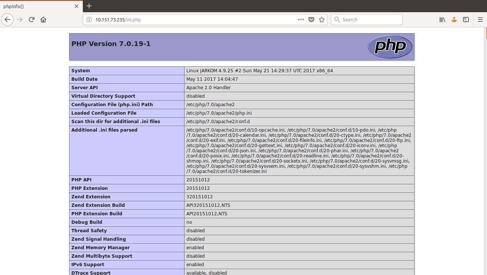

Untuk membuat sebuah halaman atau website, kita dapat menambahkannya pada direktori __/var/www/html__. Langkah-langkahnya sama seperti saat membuat halaman __ini.php__.

Sekarang bayangkan ketika kita ingin mengakses sebuah halaman web kita harus mengetikkan alamat IPnya terlebih dahulu. Ribet kan? Maka kita akan membuatnya menjadi mudah, silahkan lakukan konfigurasi sehingga ketika kita mengakses __pucang.com__ akan diarahkan ke halaman web yang sudah kita buat. 


Jika lupa caranya, silahkan buka lagi modul sebelumnya yang membahas tentang [DNS](https://github.com/rohanaq/jarkom2/tree/master/DNS).

### 2.3 Mengubah Direktori Default
Cobalah membuat sebuah halaman web di luar direktori __/var/www/html__ sebagai contoh kita akan membuat halaman __coba.php__ pada direktori __/var/www__. Maka ketika diakses akan muncul seperti gambar di bawah:

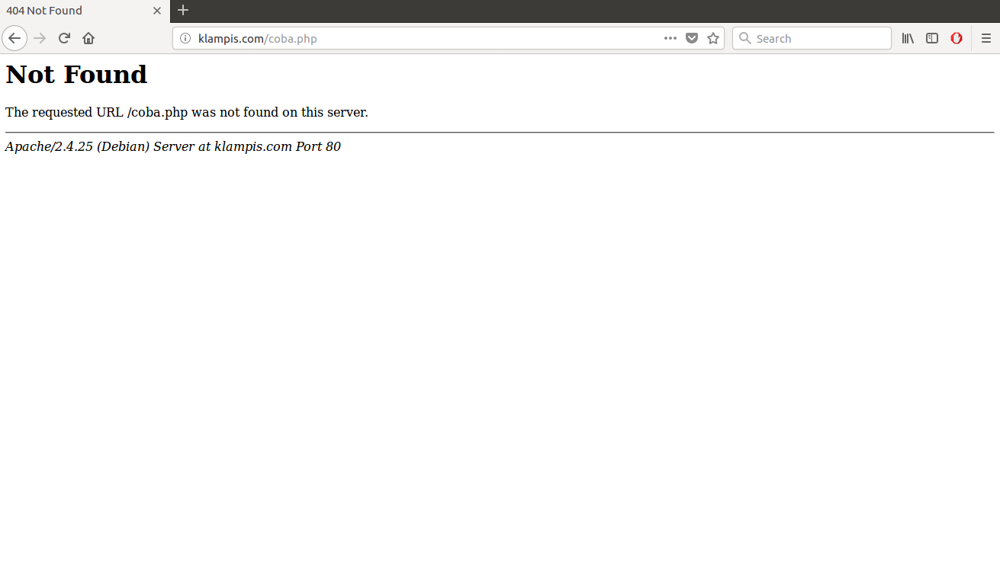

Tulisan yang ditampilkan pada browser adalah __NOT FOUND__, karena secara default web server apache akan mengakses file-file yang ada pada direktori __/var/www/html__. Namun halaman __coba.php__ tetap bisa diakses dengan cara mengubah direktori default dengan mengetikkan:
```
nano /etc/apache2/sites-enabled/000-default.conf
```

Setelah itu ubah __DocumentRoot__ menjadi __/var/www/__ seperti gambar di bawah ini:

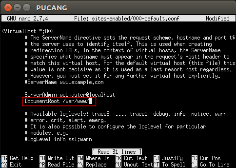

Setelah itu restart apache2 dengan perintah `service apache2 restart` dan coba akses kembali halaman __coba.php__ pada browser kalian.

### 2.4 Konfigurasi VirtualHost
Sekarang kita akan mengkonfigurasi __VirtualHost__ untuk bisa mengakses web server. Pada PUCANG lakukan copy file terhadap file konfigurasi bawaan dari apache2. Setelah menyalin file konfigurasi bukalah dengan perintah __nano__
```
cd /etc/apache2
cp sites-available/000-default.conf sites-available/default2.conf
nano sites-available/default2.conf
```

Lalu silahkan ganti port pada __VirtualHost__ menjadi 8080, dan ubah __DocumentRoot__ menjadi /var/www/8080 dan tambahkan sintaks seperti di bawah ini:
```
<VirtualHost *:8080>
```

```
ServerAdmin webmaster@localhost
DocumentRoot /var/www/8080

<Directory /var/www/8080>
AllowOverride All
</Directory>
```

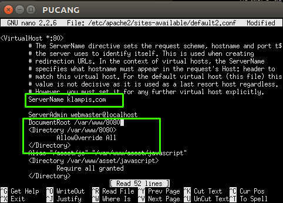

Lalu tambahkan port 8080 dengan mengedit file __ports.conf__ yang ada pada __/etc/apache2__. Tambahkan dengan sintaks `listen 8080`

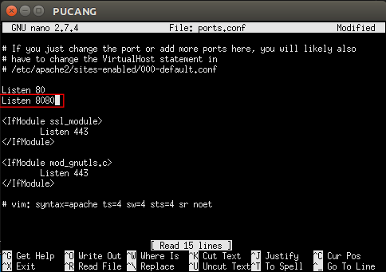

Kemudian pada folder __/var/www__ buatlah folder 8080 dan setelah itu buatlah file index.php pada folder tersebut
```
cd /var/www
mkdir 8080
nano 8080/index.php
```

Lalu pada file index.php tersebut isikan tulisan seperti di bawah ini:
```html
<!DOCTYPE html>
<html>
<head>
    <title>JARKOM 2018</title>
</head>
<body>
    <h3>INI PORT 8080</h3>
</body>
</html>
```

Lalu untuk menjalankannya ketikkan `a2ensite default2.conf` dan kemudian restart apache2 dengan perintah `service apache2 restart`. Setelah itu pada browser silahkan akses website kalian dengan menggunakan __IP PUCANG TIAP KELOMPOK__ atau dengan DNS yang sudah dibuat, lalu tambahkan port 8080 pada akhir penulisannya. Contoh -> __10.151.73.235:8080__ atau __pucang.com:8080__. Maka akan muncul seperti gambar di bawah:

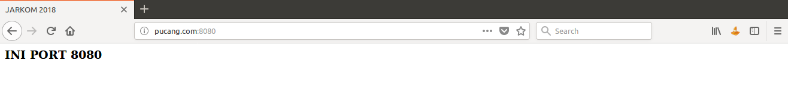

### 2.5 Alias Directory
Alias directory adalah membuat direktori lebih mudah diakses tetapi tetap di bawah DocumentRoot. Silahkan masuk ke dalam __/etc/apache2__ kemudian buka file __default2.conf__ yang sebelumnya sudah dikonfigurasi untuk poin sebelumnya. Edit file tersebut dan tambahkan seperti gambar di bawah ini:

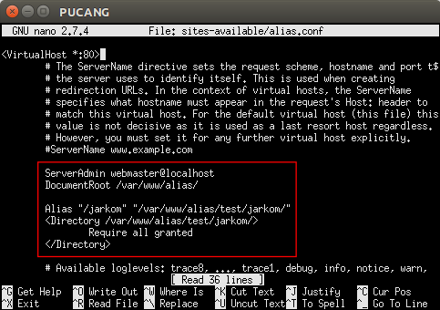

Kemudian restart apache2 dengan perintah `service apache2 restart`. Setelah itu buatlah direktori __/alias/test/jarkom/__ dengan mengetikkan
```
mkdir /var/www/alias
mkdir /var/www/alias/test
mkdir /var/www/alias/test/jarkom
```

Kemudian pada direktori __/var/www/alias/test/jarkom__ buatlah sebuah file bernama __jarkom.php__.

Sekarang coba buka pada browser __IP PUCANG TIAP KELOMPOK/jarkom__ atau __pucang.com/jarkom__ (sesuai dengan DNS yang sudah dibuat masing-masing kelompok)


Lalu apa perbedaannya ketika kita mengakses __/test/jarkom__?
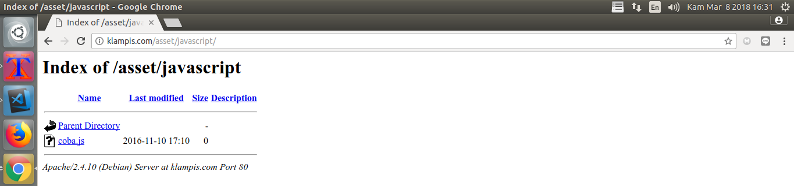

### 2.6 Directory Listing
Silahkan masuk ke dalam __/etc/apache2__ kemudian buka file __default2.conf__ yang sebelumnya sudah dikonfigurasi untuk poin sebelumnya. Edit file tersebut dan tambahkan seperti gambar di bawah ini:

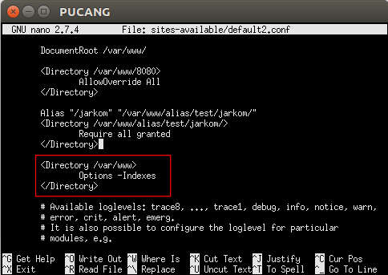

Kemudian coba akses website masing-masing maka akan muncul gambar seperti ini:

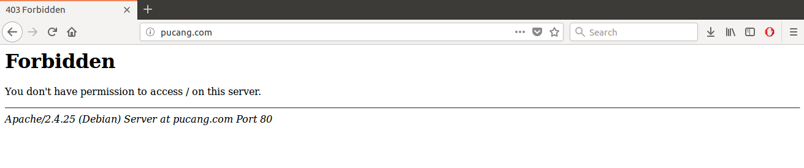

Lalu bagaimana cara agar kita dapat melihat isi dari direktori tersebut? Buka kembali __default2.conf__ dan ganti seperti gambar di bawah:

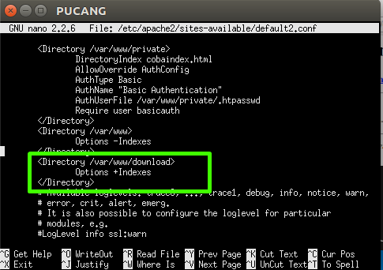

Setelah itu restart apache2 dan coba akses kembali website masing-masing maka kita dapat melihat isi file dari direktori seperti gambar di bawah:

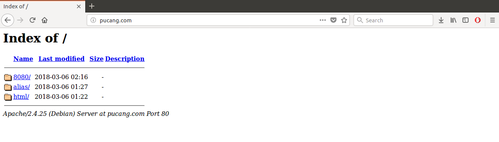

### 2.7 Allow dan Deny
Dalam web server dibutuhkan adanya proteksi dan penjagaan terhadap web server agar tetap aman. Dalam web server, kita bisa membatasi hak akses siapa saja yang boleh mengakses web server tersebut.

Silahkan masuk ke dalam __/etc/apache2__ kemudian buka file __default2.conf__ yang sebelumnya sudah dikonfigurasi untuk poin sebelumnya. Edit file tersebut dan tambahkan seperti gambar di bawah ini:

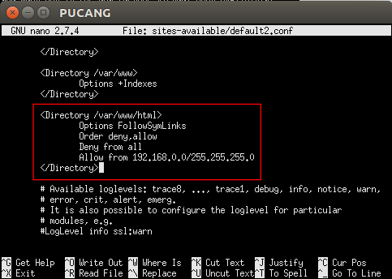

Restart apache2 kemudian coba akses website masing-masing maka direktori __html__ akan menghilang:

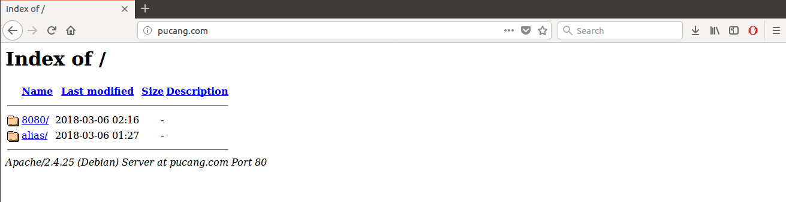

### 2.8 Basic Authentication
Basic Authentication digunakan untuk mebatasi akses terhadap suatu halaman dengan memberikan suatu autentikasi untuk user-user tertentu dengan password yang sudah ditentukan.

Silahkan masuk ke dalam __/etc/apache2__ kemudian buka file __default2.conf__ yang sebelumnya sudah dikonfigurasi untuk poin sebelumnya. Edit file tersebut dan tambahkan seperti gambar di bawah ini:

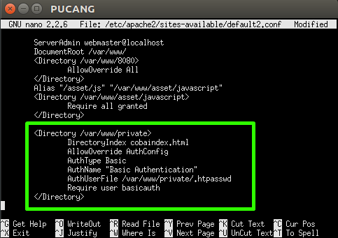

Kemudian buat folder __/var/www/basic__ dengan perintah `mkdir /var/www/basic` dan buatlah file index.html di dalamnya. Pada file index.html isikan apa saja, sebagai contoh:
```html
<html>
<head>
    <title>JARKOM 2018</title>
</head>
<body>
    <h3>Basic Authentication</h3>
</body>
</html>
```

Setelah itu ketikkan sintaks berikut:
```
htpasswd -c /var/www/basic/.htpasswd basicauth
```

__Keterangan__:
* __htpasswd__
Untuk menambahkan autentikasi basic untuk sebuah user
* __/var/www/basic/.htpasswd__
File yang menyimpan data user dan password
* __basicauth__
Nama user

Kemudian akan muncul permintaan password untuk user __basicauth__, isi permintaan password tersebut sesuai dengan keinginan kalian.

Untuk mencobanya, akses pada browser kalian dengan mengetikkan __IP PUCANG TIAP KELOMPOK/basic__ atau __pucang.com/basic__ (sesuai dengan DNS yang sudah dibuat masing-masing kelompok)

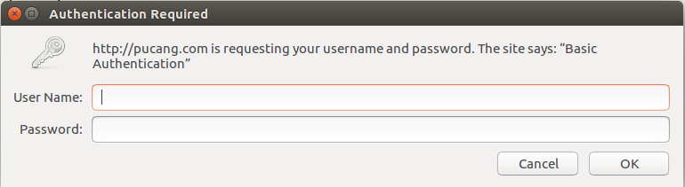

Masukkan user dan password yang sudah dibuat sebelumnya maka halaman index.html akan ditampilkan:
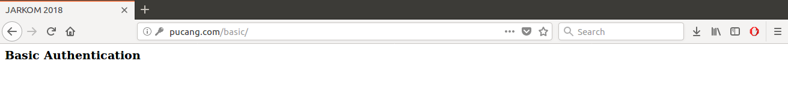

Jika user dan password tidak dimasukkan maka akan muncul halaman __401 Unauthorized__ seperti gambar di bawah:

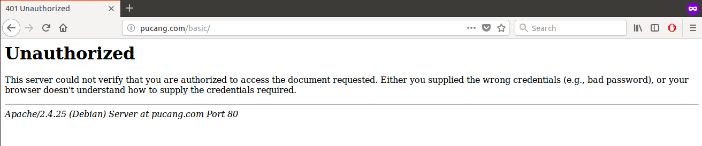

### 2.9 Digest Authentication